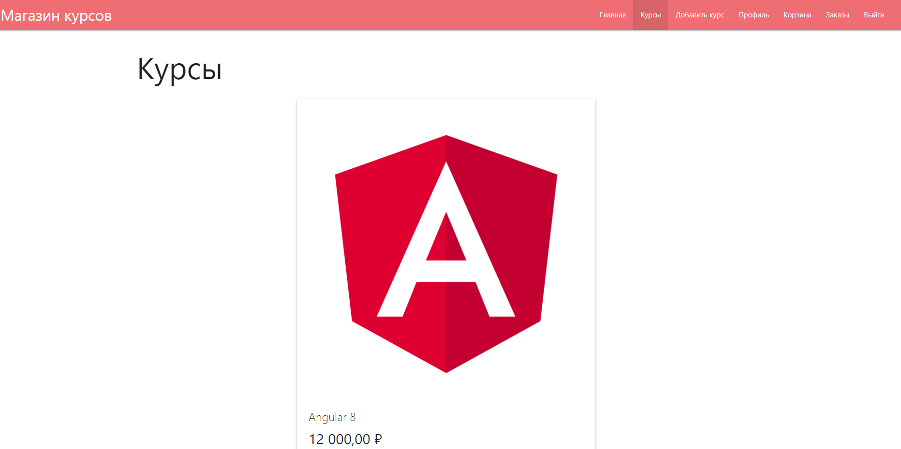
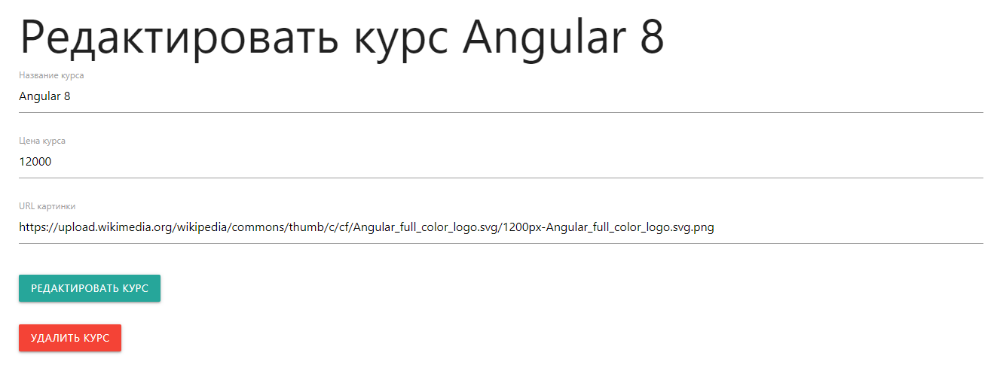
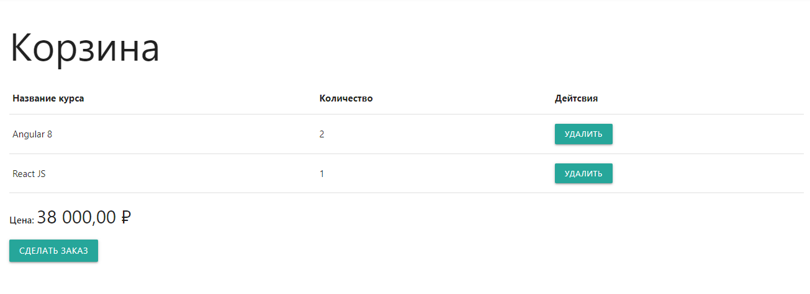
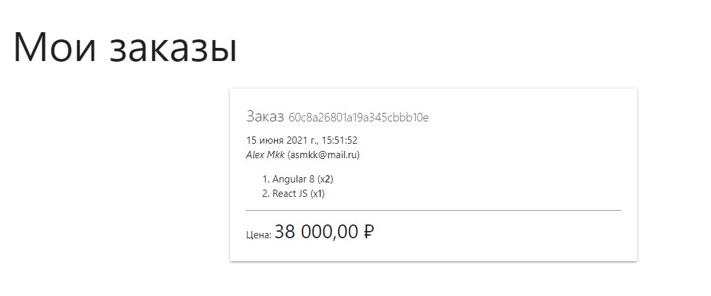

# Описание
Приложение представляет собой подобие интернет-магазина курсов. 
Реализовано на Node + Express + Handlebars + MongoDB

# Внешний вид приложения
* Список курсов 

* Редактирование информации о курсе 

* Корзина 

* Заказы 

* Профиль 

